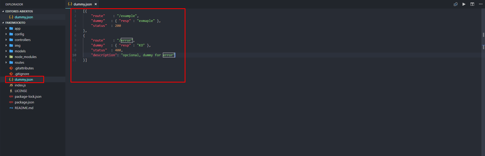
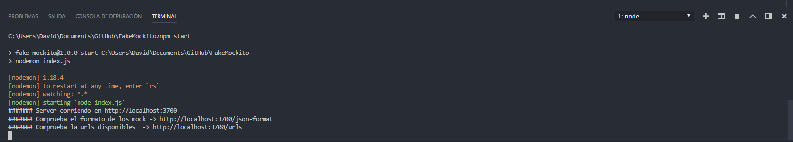
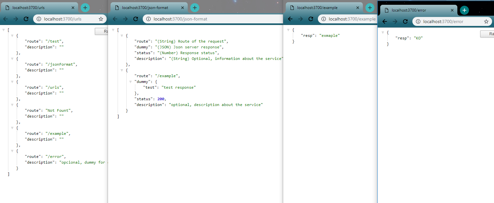

# Fake Mockito APP

Servidor node para respuestas mocks sin complicarte la vida.
Añadir un nuevo registro a un archivo json y listo ya tienes tu servidor escuchando es ruta.

# Instalación y lanzamiento del serve
`````
npm i
npm start
`````
y listo! corriendo en -> localhost:3700/

# Demostración
* Fichero para definir las rutas



* Comando de lanzamiento



* Respuestas




